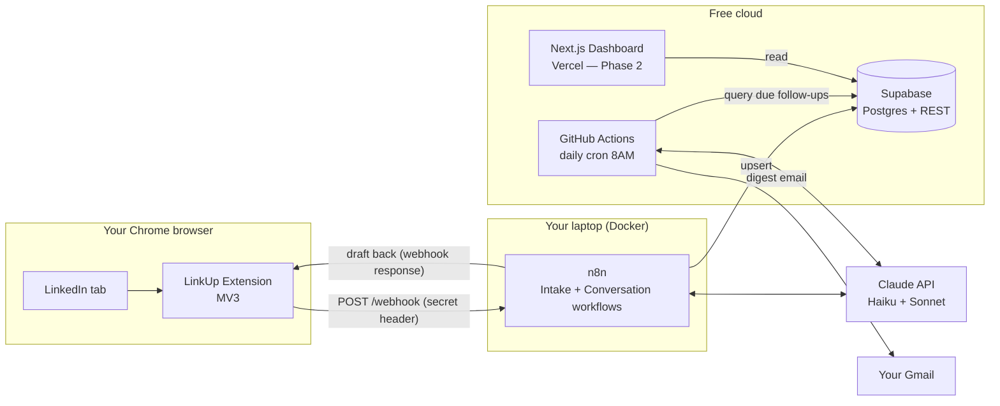
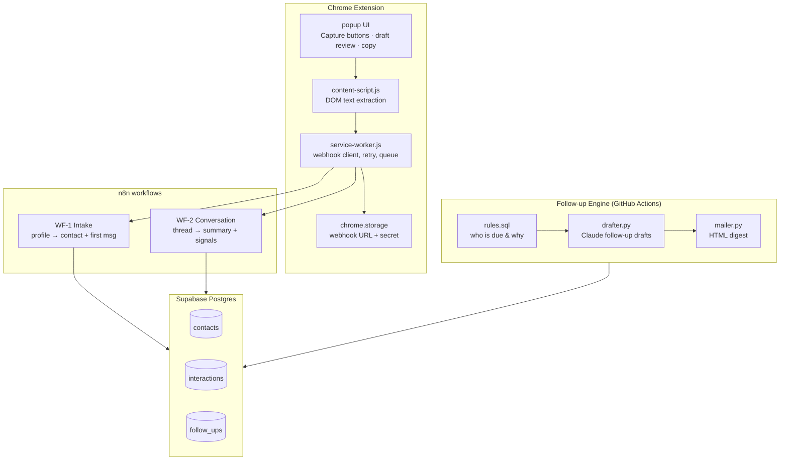
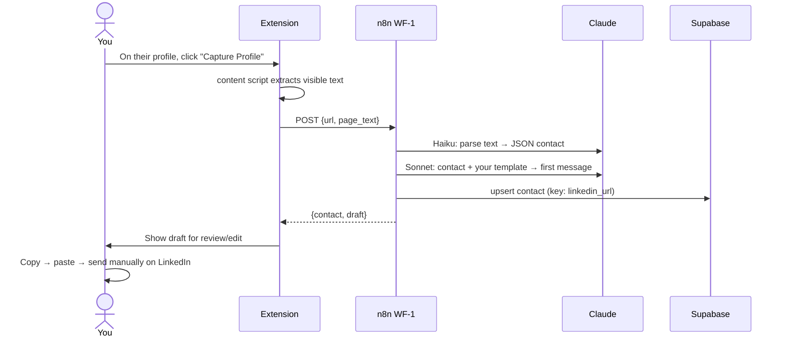
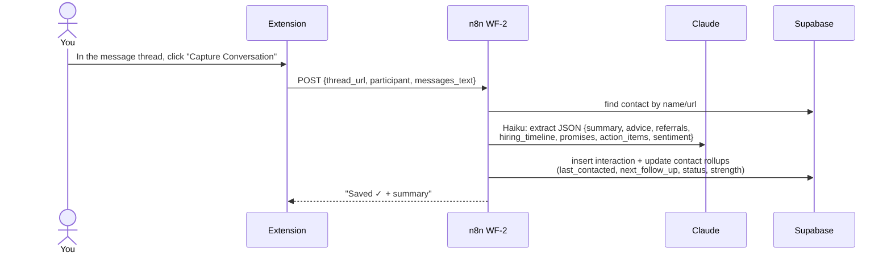
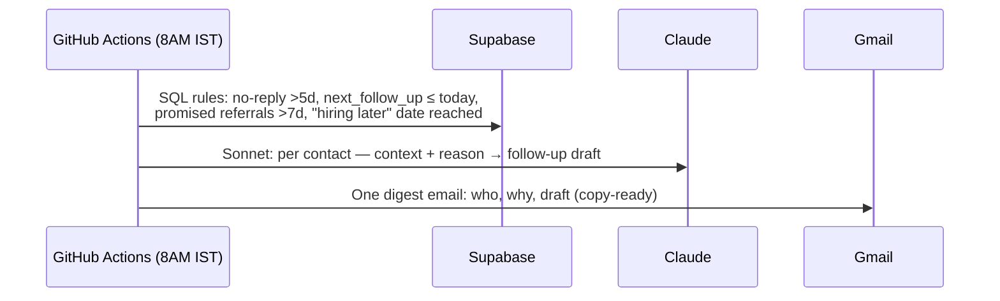
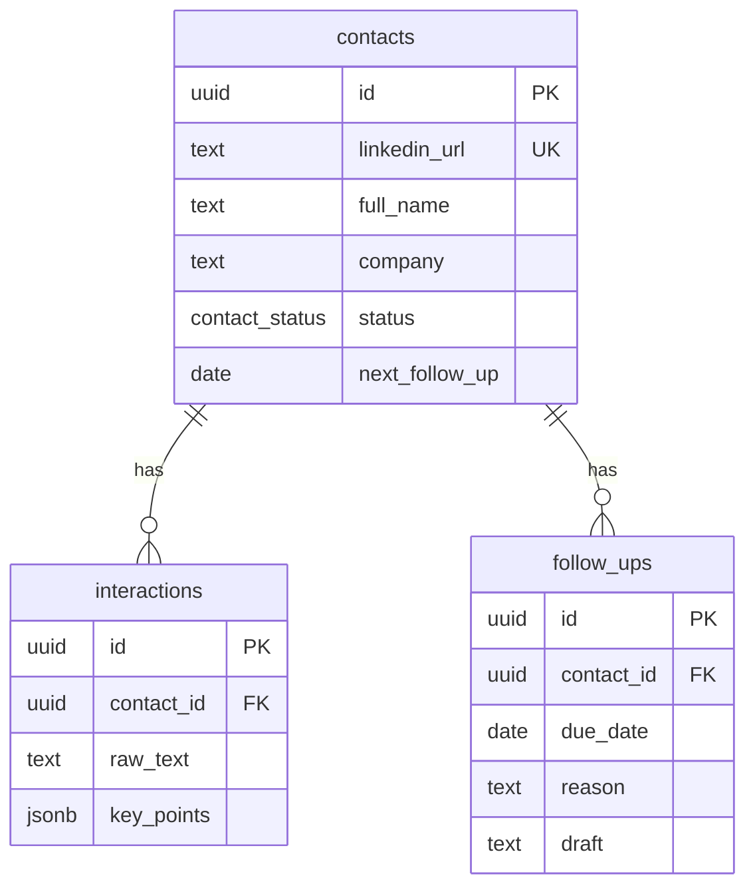

# LinkUp — AI Networking Assistant for LinkedIn

**Architecture & Engineering Plan** · v1.0 · July 2026
Owner: Sagnik Paul · Constraint: ₹0/month infra (API usage only, ~₹100–300/mo)

---

## 1. Executive Summary & Guiding Principles

LinkUp is a **human-in-the-loop AI relationship manager**. It never sends anything on LinkedIn. It captures what you're already looking at (one click), enriches it with AI, stores it in a real database, and hands drafts back to you for review.

**Guiding principles (these drive every design decision below):**

1. **Assist, never act.** No auto-sending, no background scraping, no headless browsers. All capture is user-initiated on pages you're viewing. This is the only defensible position under LinkedIn's ToS — and it also makes the system radically simpler.
2. **One click per capture.** The cost of using the system must be near zero or you'll stop using it.
3. **Boring database, smart prompts.** The intelligence lives in well-designed prompts and schema, not in an agent framework. Frameworks are added only when a concrete need appears.
4. **Postgres is the source of truth.** Everything else (dashboard, digests, drafts) is a view over it.
5. **₹0 infra.** Free tiers only; the single paid input is LLM API tokens.

---

## 2. Product Architecture

Five modules, mapped 1:1 to your five stages:

| Module | What it does | Trigger |
|---|---|---|
| **Capture** (Chrome extension) | Grabs profile text or conversation text from the LinkedIn tab you have open; shows AI drafts for review; copy-to-clipboard | You click a button |
| **Intake Pipeline** (n8n) | Profile text → structured contact record → personalized first-message draft → upsert to DB | Extension webhook |
| **Conversation Pipeline** (n8n) | Thread text → summary, action items, referral/hiring signals, relationship score → update DB | Extension webhook |
| **Follow-up Engine** (scheduled) | Daily scan of DB → who needs a nudge, why → AI-drafted follow-ups → morning email digest | Cron, 8:00 AM |
| **Dashboard** (Next.js, later) | Funnel, reply rate, companies covered, follow-ups due, hiring pipeline | You open it |

---

## 3. Technology Stack — Decisions and Rationale

### 3.1 The chosen stack

| Layer | Choice | Why |
|---|---|---|
| Capture | **Chrome Extension (Manifest V3)** | Only compliant way to read LinkedIn pages: it reads the DOM of a tab *you* opened, on *your* click. No Playwright/Browserbase needed. |
| Orchestration | **n8n (self-hosted, Docker, free)** | Visual, debuggable, native Webhook + HTTP + Postgres + Anthropic nodes. Your interactive flows only need to run while you're browsing LinkedIn — so n8n on your laptop is fine. |
| Database + API | **Supabase (free tier)** | Real Postgres + auto-generated REST API + table editor UI (a free interim CRM view) + `pg_cron`/Edge Functions for the always-on scheduler. 500 MB free = years of contacts. |
| AI | **Claude API** — Haiku for parsing/extraction, Sonnet for message drafting | Parsing needs cheap+fast; drafts need quality. Two-tier keeps cost ~₹1–2 per contact. |
| Scheduler | **GitHub Actions cron** (or Supabase pg_cron) | Your laptop isn't always on; GitHub Actions scheduled workflows are free and always-on. Calls a script that queries Supabase + Claude and emails the digest. |
| Digest delivery | **Gmail via n8n node / SMTP** | Free, you already read email every morning. |
| Dashboard (Phase 2) | **Next.js on Vercel (free)** reading Supabase | Free hosting, trivial Supabase integration. Until then, Supabase's table editor is your dashboard. |

### 3.2 What we're NOT using, and why

| Option | Verdict | Reason |
|---|---|---|
| LangGraph / LangChain / CrewAI / OpenAI Agents SDK | ❌ for MVP | Your pipelines are **deterministic**: capture → extract → draft → store. No dynamic tool selection, no multi-agent negotiation. A framework here adds debugging surface and zero capability. Revisit only if you later build a conversational "ask my network" agent. |
| Playwright / Browserbase | ❌ | Headless automation of LinkedIn = high ban risk + clear ToS violation. The extension gets identical data compliantly. |
| Pinecone / ChromaDB / any vector DB | ❌ for MVP | You'll have hundreds of contacts, not millions of documents. Postgres full-text search (or `pgvector` inside Supabase later — still ₹0) covers "find everyone who mentioned referrals." |
| Firebase | ❌ | NoSQL fits this badly — your data is relational (contacts ↔ interactions ↔ follow-ups) and you want SQL analytics for the dashboard. |
| Google Sheets / Airtable / Notion as CRM | ❌ as source of truth | See §7.1. |

---

## 4. System Architecture Diagram



---

## 5. Component Diagram



---

## 6. Data Flow Diagrams

### 6.1 Stage 1 — Connection accepted → first message



### 6.2 Stage 2 — Conversation capture



### 6.3 Stage 4 — Daily follow-up engine



---

## 7. CRM Choice & Database Schema

### 7.1 Sheets vs Airtable vs Notion vs Supabase vs raw Postgres

| Option | Pros | Cons | Verdict |
|---|---|---|---|
| Google Sheets | Zero setup, familiar | No relations, no types, breaks at scale, painful querying from code, race conditions on concurrent writes | Fine as an *export*, not the source of truth |
| Airtable | Nice UI, relations | Free tier caps (1k records/base, API rate limits), lock-in, weak SQL | ❌ |
| Notion | Great notes UX | Slow API, weak filtering, not a database | Good for *personal notes*, not CRM |
| Raw PostgreSQL | Full power | You'd have to host it and build an API + admin UI | Unnecessary work |
| **Supabase** | Real Postgres + free REST API + built-in table editor UI + auth + pg_cron | Free tier pauses after 7 days inactivity (daily cron prevents this) | ✅ **Chosen** |

Supabase gives you raw-Postgres power with Airtable-like ergonomics for free. Optional: an n8n step can mirror key columns to a Google Sheet if you want a familiar view.

### 7.2 Schema (DDL)

```sql
-- 001_init.sql
create type contact_status as enum
  ('request_sent','accepted','messaged','in_conversation','dormant','closed');

create table contacts (
  id                uuid primary key default gen_random_uuid(),
  linkedin_url      text unique not null,          -- natural key, dedupes captures
  full_name         text not null,
  headline          text,
  company           text,                          -- current
  role              text,
  previous_companies text[],
  college           text,
  location          text,
  is_bits_alum      boolean default false,         -- your strongest hook
  connection_date   date,
  first_message     text,
  status            contact_status default 'accepted',
  relationship_strength smallint check (relationship_strength between 1 and 5),
  referral_potential    smallint check (referral_potential between 1 and 5),
  hiring_status     text,                          -- 'hiring_now'|'hiring_later'|'not_hiring'|'unknown'
  hiring_notes      text,                          -- "team hiring interns in Aug"
  last_contacted    date,
  next_follow_up    date,
  tags              text[],                        -- {'fintech','referral-promised'}
  important_notes   text,
  ai_notes          text,                          -- rolling AI-maintained context
  conversation_summary text,                       -- rolling summary (latest)
  raw_profile_text  text,                          -- what the extension captured
  created_at        timestamptz default now(),
  updated_at        timestamptz default now()
);

create table interactions (
  id             uuid primary key default gen_random_uuid(),
  contact_id     uuid references contacts(id) on delete cascade,
  captured_at    timestamptz default now(),
  direction      text,                    -- 'capture' | 'draft_generated'
  raw_text       text not null,           -- full thread snapshot (append-only)
  summary        text,
  key_points     jsonb,                   -- {advice:[], referrals:[], hiring:[], promises:[], action_items:[]}
  sentiment      text                     -- 'warm'|'neutral'|'cold'
);

create table follow_ups (
  id             uuid primary key default gen_random_uuid(),
  contact_id     uuid references contacts(id) on delete cascade,
  due_date       date not null,
  reason         text not null,           -- 'no_reply_5d'|'promised_referral'|'hiring_window'|'manual'
  draft          text,
  status         text default 'pending',  -- 'pending'|'sent'|'dismissed'
  created_at     timestamptz default now()
);

create index on contacts (next_follow_up) where status not in ('closed','dormant');
create index on contacts (company);
create index on interactions (contact_id, captured_at desc);
```

**Design notes:** `interactions.raw_text` is append-only — you never lose a conversation even if a summary is bad. Contact-level fields (`conversation_summary`, `last_contacted`, `next_follow_up`) are *rollups* recomputed on each capture. `linkedin_url` as the unique key makes every capture an idempotent upsert.



---

## 8. AI Architecture — Prompt Pipeline, Not Agent Swarm

Four single-purpose AI calls, each with one job, JSON-schema-constrained where structure matters:

| # | Name | Model | Input | Output |
|---|---|---|---|---|
| A1 | **Profile Parser** | Haiku | Raw page text | JSON contact fields |
| A2 | **First-Message Writer** | Sonnet | Parsed contact + your template + your bio | 1 message (<300 chars) + 1 alternate |
| A3 | **Conversation Analyst** | Haiku | Thread text + prior summary | JSON: summary, key_points, sentiment, suggested next_follow_up, strength/referral scores |
| A4 | **Follow-up Drafter** | Sonnet | Contact record + reason due + last summary | Short follow-up draft |

Why this beats an "agent": every call is independently testable, costs are predictable, failures are localized, and there's no hidden loop that could hallucinate an action. The key robustness trick: **the LLM is the parser**. LinkedIn's DOM classes are obfuscated and change weekly; CSS-selector scrapers break constantly. Extracting *visible text* and letting Haiku structure it is nearly immune to markup changes.

### 8.1 The prompts

**A1 — Profile Parser (Haiku, temperature 0):**

```
You extract structured data from LinkedIn profile page text.
Return ONLY valid JSON matching this schema:
{full_name, headline, company, role, previous_companies[], college,
 location, is_bits_alum (true if BITS Pilani appears in education), notable_points[]}
Use null for missing fields. Do not invent data.

PAGE TEXT:
{{page_text}}
```

**A2 — First-Message Writer (Sonnet):**

```
You write LinkedIn first messages for Sagnik, a BITS Pilani student
networking for internships/full-time roles.

STYLE RULES:
- Under 300 characters. No flattery ("I'm so impressed by...").
- One specific hook from THEIR profile (shared college, their team, a post, career path).
- One clear, small ask (a quick chat, one question) — never "please refer me".
- Warm, direct, zero corporate tone. Sound like a smart student, not a bot.

MY TEMPLATE / VOICE EXAMPLE:
{{user_template}}

THEIR PROFILE (JSON):
{{contact_json}}

Return JSON: {message, alternate, hook_used}
```

**A3 — Conversation Analyst (Haiku, temperature 0):**

```
Analyze this LinkedIn conversation between Sagnik (job-seeking student)
and {{contact_name}}. Prior summary (may be empty): {{prior_summary}}

Return ONLY JSON:
{summary (3-4 sentences, merged with prior summary),
 advice[], referrals[] (anything about referring/recommending),
 hiring_timeline[] (roles, dates, "we're hiring in August"),
 promises[] (things either party said they'd do),
 action_items_for_sagnik[],
 sentiment: warm|neutral|cold,
 relationship_strength: 1-5, referral_potential: 1-5,
 suggested_next_follow_up: ISO date or null,
 follow_up_reason: string or null}

CONVERSATION:
{{thread_text}}
```

**A4 — Follow-up Drafter (Sonnet):**

```
Draft a short LinkedIn follow-up from Sagnik to {{contact_name}}.

WHY NOW: {{reason}}          (e.g., "promised referral 9 days ago")
RELATIONSHIP CONTEXT: {{conversation_summary}}
LAST CONTACTED: {{last_contacted}}

RULES: under 250 chars, reference something concrete from the context,
don't guilt-trip, don't repeat the previous message, give them an easy out.
Return JSON: {draft, tone_note}
```

---

## 9. APIs Required

| API | Used by | Auth | Cost |
|---|---|---|---|
| Claude Messages API | n8n, follow-up engine | `x-api-key` (env) | ~₹1–2/contact; ₹100–300/mo at your volume |
| Supabase REST (PostgREST) | n8n, engine, dashboard | `service_role` key (server-side only) | Free |
| n8n Webhooks (2) | Extension → n8n | Shared secret header `X-LinkUp-Secret` | Free |
| Gmail SMTP / n8n Gmail node | Digest | App password / OAuth | Free |
| **NOT** the LinkedIn API | — | — | Official API doesn't expose profiles/messaging to individuals; irrelevant here |

---

## 10. Browser Extension Architecture

Manifest V3, three parts, deliberately dumb (all intelligence is server-side):

```
extension/
├── manifest.json          # MV3; permissions: activeTab, storage, clipboardWrite;
│                          # host_permissions: https://www.linkedin.com/*
├── content-script.js      # runs on linkedin.com; two extractors:
│                          #   extractProfileText()  — profile pages: innerText of main,
│                          #     trimmed to relevant sections, capped ~6k chars
│                          #   extractThreadText()   — messaging: message list innerText
│                          #     with sender labels, last N messages
├── service-worker.js      # receives {type, payload} from content script;
│                          # POSTs to n8n webhook with secret; 1 retry; queues offline
├── popup/
│   ├── popup.html         # [Capture Profile] [Capture Conversation] buttons
│   ├── popup.js           # detects page type from URL; shows returned draft
│   │                      # in editable textarea; [Copy] button; status toasts
│   └── popup.css
└── options/
    └── options.html       # webhook URL + secret (chrome.storage.sync)
```

Key behaviors: page-type detection via URL (`/in/` = profile, `/messaging/` = thread); the popup renders the AI draft in an **editable textarea** — you can tweak before copying (review-before-send is a product feature, not just compliance); zero background activity — the extension does nothing until clicked.

---

## 11. n8n Workflow Design

**WF-1 · Intake** (`POST /webhook/linkup-profile`)

```
Webhook → Verify secret (IF node, 401 on fail)
        → Anthropic [A1 Haiku: parse profile]
        → Anthropic [A2 Sonnet: first message]
        → Supabase upsert contacts (on_conflict: linkedin_url)
        → Respond to Webhook {contact, draft}
```

**WF-2 · Conversation** (`POST /webhook/linkup-thread`)

```
Webhook → Verify secret
        → Supabase: find contact (by url, fallback name ILIKE)
        → IF not found → Respond {error:"capture profile first"}
        → Anthropic [A3 Haiku: analyze]
        → Supabase: insert interactions row
        → Supabase: update contact rollups (summary, last_contacted,
          next_follow_up, strength, referral_potential, status='in_conversation')
        → IF suggested_next_follow_up → insert follow_ups row
        → Respond {summary, action_items}
```

**WF-3 · Daily digest** — lives in **GitHub Actions**, not n8n (laptop-off problem):

```yaml
# .github/workflows/daily-digest.yml
on:
  schedule: [{cron: "30 2 * * *"}]   # 02:30 UTC = 8:00 AM IST
  workflow_dispatch: {}               # manual trigger for testing
jobs:
  digest:
    runs-on: ubuntu-latest
    steps:
      - uses: actions/checkout@v4
      - run: pip install -r engine/requirements.txt
      - run: python engine/daily_digest.py
        env:
          SUPABASE_URL: ${{ secrets.SUPABASE_URL }}
          SUPABASE_SERVICE_KEY: ${{ secrets.SUPABASE_SERVICE_KEY }}
          ANTHROPIC_API_KEY: ${{ secrets.ANTHROPIC_API_KEY }}
          GMAIL_APP_PASSWORD: ${{ secrets.GMAIL_APP_PASSWORD }}
```

`daily_digest.py` rule set (SQL): messaged but no reply in 5+ days · `next_follow_up <= today` · promised referral >7 days ago · `hiring_status='hiring_later'` and window approaching · dormant 30+ days with `strength >= 3`. Each hit → A4 draft → one HTML email grouped by reason.

---

## 12. Repository / Folder Structure

Monorepo — one portfolio repo, one README, everything versioned together:

```
linkup/
├── README.md                     # product story + demo GIF (portfolio front door)
├── ARCHITECTURE.md               # this document
├── extension/                    # (see §10)
├── n8n/
│   ├── docker-compose.yml
│   └── workflows/                # exported WF-1.json, WF-2.json (version-controlled!)
├── db/
│   └── migrations/001_init.sql
├── engine/
│   ├── daily_digest.py
│   ├── rules.sql
│   ├── prompts.py                # A1–A4 templates, single source of truth
│   └── requirements.txt
├── dashboard/                    # Phase 2 — Next.js app
├── .github/workflows/daily-digest.yml
└── .env.example                  # never commit .env
```

---

## 13. MVP Definition

**MVP = Stages 1–3 + digest, no dashboard.** Concretely, you can: click once on a profile → get a reviewed, personalized first message + contact saved; click once on a thread → conversation summarized, signals extracted, CRM updated; receive an 8 AM email with due follow-ups and copy-ready drafts; browse everything in the Supabase table editor.

**Explicitly out of MVP:** dashboard, auto-detection of accepted requests, profile-change monitoring, "recently posted" tracking, vector search, mobile.

**Success criteria:** capture-to-draft < 10 seconds; conversation capture < 3 clicks total; you stop maintaining the Google Sheet manually; zero LinkedIn warnings.

---

## 14. Development Roadmap & Timeline

Assuming ~10 focused hours/week alongside coursework:

| Phase | Weeks | Delivers |
|---|---|---|
| 0 — Foundations | Week 1 | Supabase schema live, n8n in Docker, keys wired |
| 1 — Capture + Intake | Weeks 1–2 | Extension + WF-1: profile → draft → DB |
| 2 — Conversations | Week 3 | WF-2: thread → summary → CRM update |
| 3 — Follow-up engine | Week 4 | GitHub Actions digest |
| 4 — Hardening | Week 5 | Auth, retries, backups, README + demo GIF |
| 5 — Dashboard | Weeks 6–7 | Next.js on Vercel |

**~5 weeks to a genuinely useful MVP; ~7 weeks to portfolio-complete.**

---

## 15. Future Improvements (post-MVP, in priority order)

1. **Dashboard** (§2, Phase 2) — funnel: requests → accepted → messaged → replied → referral; reply rate; companies covered; follow-ups due.
2. **"Ask my network" chat** — natural-language queries over the CRM ("who at Razorpay mentioned hiring?"). This is the point where a small agent (Claude + SQL tool) or `pgvector` earns its place.
3. **Company-change detection** — on each capture, diff `company` vs stored value; a change is a prime follow-up trigger ("congrats on the new role").
4. **A/B message analytics** — track `hook_used` (A2 already returns it) vs reply rate; learn which hooks work.
5. **Voice-note capture** — after calls, dictate notes; Whisper/Claude → interaction row.
6. **Multi-user SaaS** — Supabase auth + RLS + per-user API keys. The architecture already supports it; this is the startup pivot.

---

## 16. Security Considerations

1. **Secrets:** API keys live only in n8n credentials store, GitHub Actions secrets, and `.env` (gitignored). The extension stores only the webhook URL + shared secret — never the Claude or Supabase keys.
2. **Webhook auth:** every n8n webhook validates `X-LinkUp-Secret` (long random string) and rejects with 401. Without this, anyone who finds the URL can write to your DB and burn your Claude credits.
3. **Supabase keys:** use `service_role` only from n8n/engine (server-side). The Phase-2 dashboard uses the `anon` key + Row Level Security.
4. **Data sensitivity:** you're storing other people's professional data and private conversations. Keep the DB private, never publish real data in the portfolio repo (use seeded fake data for the demo), and delete records if someone asks.
5. **HTTPS everywhere;** if n8n is exposed beyond localhost, put it behind a tunnel with auth (e.g., Cloudflare Tunnel) — never a bare open port.
6. **Backups:** weekly `pg_dump` via GitHub Actions to a private repo/artifact. Free insurance.

---

## 17. LinkedIn Terms of Service — Position and Boundaries

LinkedIn's User Agreement (§8.2) prohibits scraping, bots, and automated access. This design's stance:

**What keeps this defensible:** all data capture is **user-initiated** (a click on a page you're viewing — functionally equivalent to copy-paste, just structured); **no automated sending** — every message is manually reviewed and manually pasted/sent by you; **no headless browsers, no session-cookie reuse, no background polling, no bulk collection**; volume is human-scale (a handful of captures a day); data is for **personal relationship management**, the same as your existing Google Sheet.

**Hard lines — never build these:** auto-send on LinkedIn, scheduled/bulk profile scraping, auto-accepting or auto-sending connection requests, monitoring feeds via automation, or reselling captured data.

**Residual risk, stated honestly:** even one-click DOM capture is not explicitly blessed by LinkedIn. The realistic risk at your volume is low (indistinguishable from normal browsing), but it's not zero — keep the extension unpublished (load-unpacked / private), and if LinkedIn ever warns you, stop capture and fall back to manual paste into the same webhook (the architecture survives: the extension is just an input method).

---

## 18. Deployment Architecture

| Component | Where | Cost | Notes |
|---|---|---|---|
| Extension | Load-unpacked in your Chrome | ₹0 | No Web Store publishing needed (and better ToS posture) |
| n8n | Docker on your laptop (`docker compose up -d`) | ₹0 | Only needed while you browse LinkedIn — which is exactly when your laptop is on. Persist `~/.n8n` volume. |
| Postgres + REST | Supabase free tier | ₹0 | Daily cron traffic prevents free-tier pause |
| Scheduler | GitHub Actions cron | ₹0 | Always-on despite laptop being off |
| Digest | Gmail (app password) | ₹0 |  |
| Dashboard | Vercel free (Phase 2) | ₹0 |  |
| Claude API | Anthropic | ~₹100–300/mo | The only real cost |

Later upgrade path (still cheap): move n8n to an always-free Oracle Cloud VM if you want webhooks available 24/7.

---

# Development Milestones

Each milestone is shippable and testable on its own. Do them in order.

---

## M0 — Foundations (Week 1, ~4h)

**Goal:** all infrastructure exists and is reachable.
**Build:** Supabase project + schema; n8n running locally; API keys wired; repo skeleton.
**Files:** `db/migrations/001_init.sql`, `n8n/docker-compose.yml`, `.env.example`, `README.md`.
**APIs:** Supabase (create project), Anthropic (create key).
**Expected output:** `select * from contacts;` runs in Supabase SQL editor; n8n UI at `localhost:5678`; a curl to a trivial test webhook returns 200.
**Testing:** insert a fake contact via Supabase REST with curl; call Claude once from an n8n Anthropic node.
**Common mistakes:** committing `.env`; skipping the docker volume (n8n workflows vanish on restart); using the `anon` key where `service_role` is needed.
**Best practices:** write the schema as a migration file from day 1, not clicks in the UI; export n8n workflows to `n8n/workflows/` after every change.

## M1 — Extension skeleton: capture profile text (Week 1–2, ~6h)

**Goal:** one click on a LinkedIn profile → clean text payload visible in the popup.
**Build:** MV3 manifest, content script with `extractProfileText()`, popup with Capture button, options page for webhook config. No n8n yet — popup just displays extracted text.
**Files:** everything under `extension/` (§10).
**APIs:** none (Chrome APIs only: `activeTab`, `storage`, `scripting`).
**Expected output:** popup shows the profile's name/headline/experience text, capped ~6k chars.
**Testing:** try 5 diverse profiles (long career, student, sparse profile, premium, non-English); confirm nothing happens on non-LinkedIn tabs.
**Common mistakes:** relying on LinkedIn CSS class selectors (obfuscated, change weekly — grab `main` innerText instead); MV3 gotcha: content scripts can't be injected on tabs opened before install (reload the tab); capturing the whole page including nav noise (trim it).
**Best practices:** keep extractors as pure functions of `document` — unit-testable against saved HTML fixtures; log payload size, cap it before it hits token costs.

## M2 — WF-1 Intake: profile → first-message draft (Week 2, ~6h)

**Goal:** captured profile comes back as a personalized draft in <10s.
**Build:** n8n WF-1 (§11); extension service worker POSTs and popup renders editable draft + Copy button.
**Files:** `n8n/workflows/WF-1.json`, `engine/prompts.py` (A1, A2), updates to `service-worker.js`, `popup.js`.
**APIs:** n8n webhook, Claude (Haiku A1, Sonnet A2).
**Expected output:** click → draft appears; you edit, copy, and send it on LinkedIn yourself.
**Testing:** golden test set: 5 saved profile texts → run through WF-1 → check JSON validity and that every draft is <300 chars, references a real profile detail, and never fabricates one; test wrong-secret returns 401.
**Common mistakes:** no `Respond to Webhook` node (extension hangs); trusting LLM JSON blindly — validate and retry once on parse failure; letting Claude see 30k chars of page text (cap in M1 pays off here).
**Best practices:** temperature 0 for A1; keep prompts in `prompts.py` and paste into n8n — one source of truth; log every A2 output to `interactions` with `direction='draft_generated'` for future A/B analytics.

## M3 — CRM persistence + dedupe (Week 2–3, ~3h)

**Goal:** every capture lands in Postgres exactly once.
**Build:** Supabase upsert node in WF-1 (`on_conflict: linkedin_url`); normalize URLs (strip query params, trailing slash) before upsert.
**Files:** WF-1 update, `db/migrations/002_*.sql` if schema tweaks emerge.
**APIs:** Supabase REST `POST /rest/v1/contacts?on_conflict=linkedin_url` with `Prefer: resolution=merge-duplicates`.
**Expected output:** capturing the same person twice updates, never duplicates.
**Testing:** capture same profile from `linkedin.com/in/x` and `linkedin.com/in/x/?utm=...` → one row.
**Common mistakes:** un-normalized URLs defeating the unique key; upsert overwriting good fields with nulls (send only non-null fields).
**Best practices:** treat this as the idempotency layer — every workflow should be safe to run twice.

## M4 — WF-2 Conversation capture (Week 3, ~8h)

**Goal:** one click in a message thread → summary + signals + CRM rollups updated.
**Build:** `extractThreadText()` in content script (sender-labeled messages); n8n WF-2 (§11) with A3.
**Files:** `content-script.js` update, `n8n/workflows/WF-2.json`, `prompts.py` (A3).
**APIs:** n8n webhook, Claude Haiku, Supabase.
**Expected output:** popup shows "Saved ✓" + 3-sentence summary; `interactions` row appended; contact's `conversation_summary`, `last_contacted`, `next_follow_up`, scores all updated.
**Testing:** threads of 2, 20, and 100 messages; a thread with a referral promise → check it lands in `key_points.referrals` and spawns a `follow_ups` row; capture the same thread twice → second interaction row is fine (append-only) but rollups stay sane.
**Common mistakes:** LinkedIn virtualizes long threads (only visible messages are in the DOM) — capture what's loaded and note the limit, don't auto-scroll (that's automation); mislabeling who said what (assert your own name appears as a sender).
**Best practices:** pass `prior_summary` into A3 so summaries accumulate instead of reset; store the raw thread text always — summaries are regenerable, raw text isn't.

## M5 — Follow-up engine + daily digest (Week 4, ~6h)

**Goal:** 8:00 AM email listing who to follow up, why, with a copy-ready draft.
**Build:** `engine/daily_digest.py` (rules SQL → A4 drafts → HTML email), GitHub Actions workflow.
**Files:** `engine/daily_digest.py`, `engine/rules.sql`, `.github/workflows/daily-digest.yml`.
**APIs:** Supabase REST, Claude Sonnet, Gmail SMTP (app password).
**Expected output:** digest grouped by reason: "Promised referrals (2) · Due follow-ups (3) · Gone quiet (4)", each with a draft.
**Testing:** `workflow_dispatch` manual run; seed contacts engineered to trip each rule; verify empty-state (no follow-ups → short "all clear" email, not a crash).
**Common mistakes:** timezone bugs (cron is UTC — 02:30 UTC = 08:00 IST); drafting follow-ups for `status='closed'` contacts; sending 20 Claude calls when 0 contacts are due (query first, draft second).
**Best practices:** cap digest at ~10 items/day (attention budget); mark generated drafts in `follow_ups` so tomorrow's run doesn't re-draft the same person.

## M6 — Dashboard (Weeks 6–7, ~12h)

**Goal:** the Stage-5 metrics on one page.
**Build:** Next.js app on Vercel: funnel (status counts), reply rate, companies covered, follow-ups due, hiring pipeline table, recent activity feed. Supabase `anon` key + RLS read policies.
**Files:** `dashboard/` app; `db/migrations/003_rls.sql`; SQL views for metrics.
**APIs:** Supabase (anon + RLS).
**Expected output:** live dashboard URL you can also show recruiters.
**Testing:** RLS check — anon key must not expose `raw_text`/conversations publicly; metrics match hand-counted SQL.
**Common mistakes:** shipping conversation content to a public page; computing metrics in React instead of SQL views.
**Best practices:** one SQL view per metric card; the dashboard is a *demo asset* — add a "demo mode" with fake seeded data for your portfolio.

## M7 — Hardening & portfolio polish (Week 5 + ongoing)

**Goal:** production-grade and presentable.
**Build:** retry/queue in service worker; JSON-parse retry wrapper on all AI calls; weekly `pg_dump` backup action; README with architecture diagram + 30-second demo GIF; seeded demo data.
**Testing:** kill n8n mid-capture → extension shows a clear error and queues the payload; malformed AI JSON → one retry then a graceful failure message.
**Common mistakes:** demoing with real people's conversations; leaving `workflow_dispatch` off the digest (you'll want manual runs forever).
**Best practices:** write the README as a product story (problem → demo → architecture), not a file listing — that's what makes it portfolio-worthy.

---

*End of architecture. Next step: M0 — say the word and we start building.*

