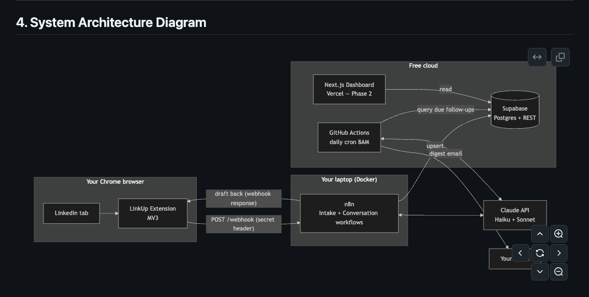
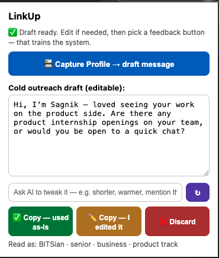
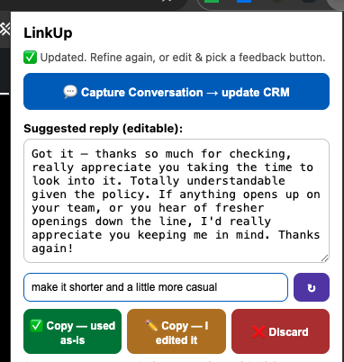
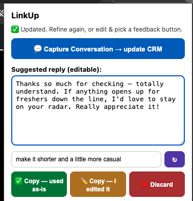
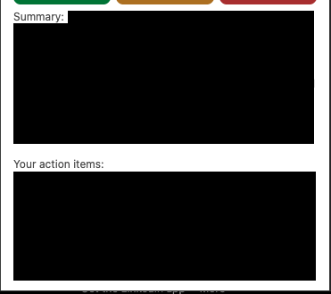

# LinkUp — AI Networking Assistant & Self-Improving CRM

> One-click LinkedIn profile capture → AI drafts outreach in *my* voice →
> refine it by chatting ("shorter, mention their post") → personal CRM →
> morning follow-up digest → a feedback loop that learns from every edit I make.

**Human-in-the-loop by design:** LinkUp never sends messages and never
scrapes. It captures only pages I'm viewing, on my click, and every AI
draft is reviewed and sent manually by me.

## Why I built it

Networking for internships meant a daily grind: open profile → copy →
paste into an AI chat → copy message back → manually log everything in a
spreadsheet → remember follow-ups myself. ~15 minutes per person, every
person, every day. LinkUp collapses that to one click per step and never
forgets a conversation.

## What it does

- **Capture** (Chrome extension, MV3) — one click on a profile or message
  thread extracts the visible page text. No brittle CSS selectors: the
  LLM is the parser, so LinkedIn markup changes don't break it. On the
  messaging page it targets only the *open* thread (not the whole inbox),
  so it never confuses who the conversation is with.
- **Draft** (Claude Haiku + Sonnet, orchestrated by n8n) — classifies each
  person (peer/mid/senior · engineering/business · product/finance track),
  then writes outreach following my personal 12-section style guide, which
  lives in Postgres and is editable without touching code.
- **Refine** (Claude Haiku 4.5) — a chat bar under every draft: type a plain-
  English change ("make it shorter", "mention I saw their post on idempotency")
  and the message is rewritten *in place*, keeping my voice. No more manual
  copy-edit-paste loops. ~₹0.15 per refine.
- **Remember** (Supabase/Postgres) — a real CRM: contacts, every
  conversation snapshot (append-only), relationship scores, hiring
  signals, referral tracking. People I messaged *before* LinkUp existed are
  auto-created on first conversation capture, and the AI backfills their
  profile fields (company, role, past companies, college) straight from the
  chat — a later profile capture only enriches, never overwrites.
- **Reply** — capturing a conversation also drafts my reply, template-
  matched to what they said (referral thanks, portal dead-end, graceful
  rejection, follow-up nudge).
- **Follow up** (GitHub Actions, 8:00 AM IST daily) — a rule engine finds
  who's due (no reply in 5 days, promised referral going quiet, scheduled
  date reached, good relationship going cold) and emails me a digest with
  copy-ready drafts. Runs even with my laptop closed.
- **Learn** — the interesting part:
  - every draft is logged with its classification and outcome
  - ✅ used / ✏️ edited / ❌ discarded feedback buttons in the extension
  - my edits are diffed by an LLM; phrases I delete in 3+ different drafts
    are auto-promoted to a permanent ban list
  - future drafts retrieve my 5 best similar past messages (matched on
    track + seniority + quality score) as few-shot examples
  - if a reply calls the message out as AI-written, that's auto-detected,
    the draft's quality score is nuked, and the count is tracked

## Screenshots

**System architecture**



**Cold-outreach draft, written in my voice** (illustrative text — real templates and contacts are never shown)



**Refine — type a change, the draft rewrites in place.** Same message, just from *"make it shorter and a little more casual"*:

| Before | After |
|--------|-------|
|  |  |

**Conversation → summary, signals, and action items** (contact details redacted)



## Architecture

Full design doc with diagrams, schema, and trade-offs:
[ARCHITECTURE.md](ARCHITECTURE.md)

```
Chrome Extension ──POST──▶ n8n (Docker, local) ◀──▶ Claude API
                              │
                              ▼
                        Supabase (Postgres CRM)
                              ▲
GitHub Actions (8AM cron) ────┘──▶ Gmail digest
```

Decisions I'd defend in an interview:

- **₹0/month infrastructure** — self-hosted n8n + Supabase free tier +
  GitHub Actions cron. Only cost is LLM tokens (~₹1–2 per contact).
- **Retrieval over fine-tuning** — metadata-matched RAG (same message
  type + track + seniority, ordered by quality score) beats embeddings at
  few-hundred-example scale, with zero extra services. `pgvector` is a
  one-migration upgrade when scale demands it.
- **No agent framework** — the pipelines are deterministic; every AI call
  has one job, one schema, one test. LangChain would add surface area
  without capability here.
- **Style guide in the database, not the prompt file** — editable rules,
  versioned by `updated_at`, injected at runtime.

## Repo layout

```
extension/      Chrome extension (MV3): capture, draft review, refine bar, feedback buttons
n8n/            docker-compose + exported workflow JSONs (WF-1 intake,
                WF-2 conversation, WF-3 feedback, WF-4 refine)
db/             Postgres schema: CRM core + learning-loop tables
engine/         Daily follow-up digest (Python, runs on GitHub Actions)
ARCHITECTURE.md Full technical design document
```

## Stack

Chrome Extension (Manifest V3) · n8n · Supabase (Postgres) ·
Claude API (Haiku 4.5 + Sonnet 5) · GitHub Actions · Python

## Running it yourself

1. Create a Supabase project; run `db/001_init.sql` then `db/002_learning.sql`.
2. Insert your own style guide into `prompt_config` (see ARCHITECTURE.md §8).
3. Copy `.env.example` → `n8n/.env`, fill your keys; `docker compose up -d` in `n8n/`.
4. Import the three workflow JSONs into n8n and activate them.
5. Load `extension/` unpacked at `chrome://extensions`; set your webhook
   secret in the extension Options.
6. Fork-friendly digest: add the five secrets in GitHub Actions and enable
   the workflow.

## Disclaimer

Personal productivity tool, built to respect LinkedIn's terms:
user-initiated capture only, human review before every send, human-scale
volume, no automated actions of any kind.

---

*Built by [Sagnik Paul](https://www.linkedin.com/in/YOUR-PROFILE) —
BITS Pilani Hyderabad, Dual Degree '27. Architecture designed in
collaboration with Claude.*
